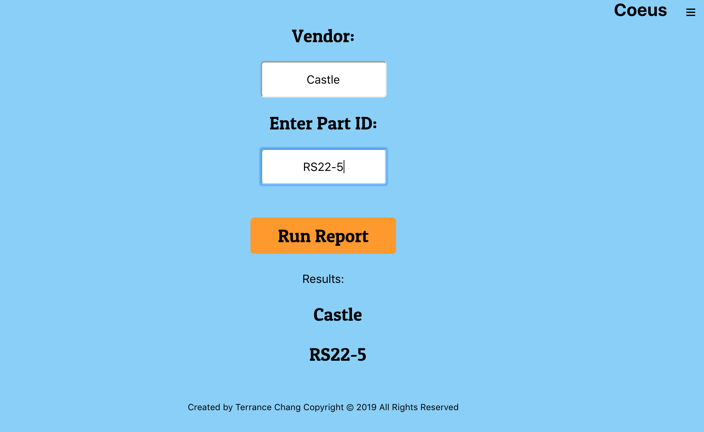
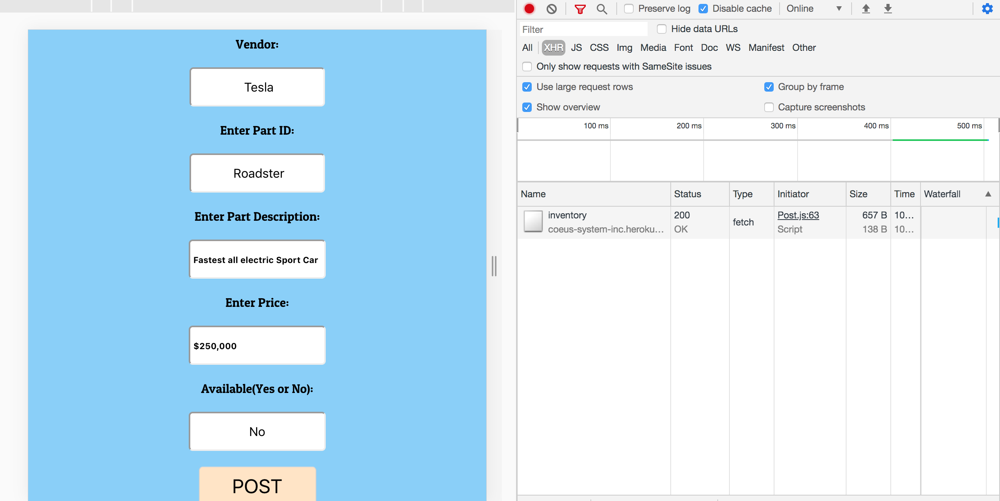

# **_Coeus System Inc._**

**Check-Out the website at:**
[Coeus-System-Inc](https://coeus-app.tchang46343.now.sh/).

For access to the API repo of Coeus System Inc. click on [Coeus-System-Inc_API](https://github.com/tchang46343/coeus-api-backend.git).

# **Application Screenshots**

## Home Page:

- The image above is the landing page for Coeus System Inc. For new customers all the information is front and center.
- Each box describes about what services we can provide for new customer if they were to use our platform.
- The page explain also who we currently have partnership with and how to get in contact with us.
- Finally, for existing clients they can click on **Home** and get access straight to the database.

## Inventory Manipulations Options:

- The image above is the data manipulation landing page for customers. Customers are allowed to view, add, delete, and update stored inventory item data.

## Data Manipulations:

- ### Display Inventory Data:

- This screen shot demonstrates the ability for the application to retrieve customer data information about specific parts and vendors information.
- As seen in the example customers can access specific data points in relations to their vendor.

- ### Add Inventory Items:

- This screen shot demonstrates the ability for the customer to post new inventory items to the database.
- As seen in the example data was entered into the required fields and then the server sent a fetch request to POST the data.

## Coeus System Inc Pitch Summary:

As a result, the benefit of using Coeus System Inc is to provide a single point inventory management system. As an added benefit the application data exists in the cloud, which in turn lets the customers have complete visibility to their products. As the application continues to develop, new features can be added to suit the customer's needs such as statical analysis, low inventory level notifications, and forecasting growth.

## Technology Languages Used:

- HTML5
- CSS3
- Javascript
- React
